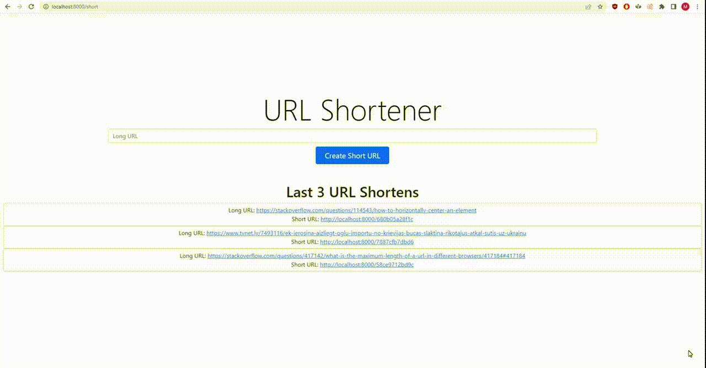

To run this project:
1. `composer install`   
2. Change this data to your MYSQL at:  `ap\Database.php` :  
[ 'dbname' => `'DATABASE_NAME'`,  
   'user' => `'USER'`,  
   'password' => `'PASSWORD'`,  
   'host' => 'localhost',  
   'driver' => 'pdo_mysql', ]  
3.Create MYSQL table :

CREATE TABLE `URL` (
`id` int NOT NULL AUTO_INCREMENT,
`long_url` text NOT NULL,
`short_url` varchar(255) NOT NULL,
PRIMARY KEY (`id`),
UNIQUE KEY `table_name_id_uindex` (`id`),
UNIQUE KEY `URL_short_url_uindex` (`short_url`)
)

4. run `php -S localhost:8000` : (To run different port - need to change port at `app\Controllers\URLController.php` - `private string $path = 'http://localhost:8000/';`)

